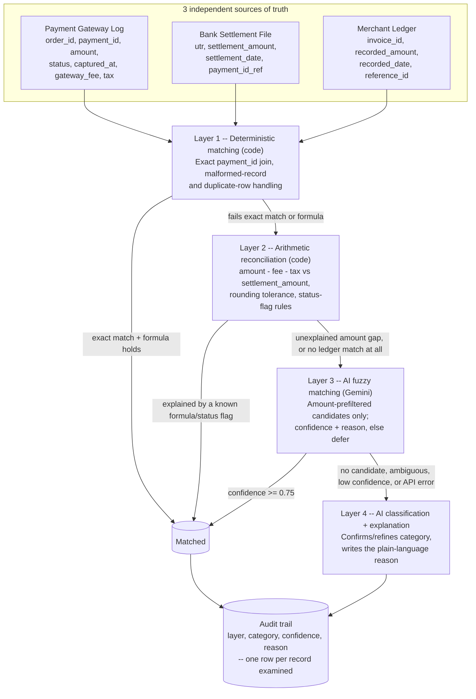

# Architecture

## Why layered, not "throw an LLM at everything"

The reconciliation problem has a wide range of difficulty across records: most
transactions match on an exact key with a simple formula: fee TDS deduction; a
handful genuinely need judgment (a reference-ID formatting difference, an
unexplained deduction). Routing everything through an LLM would be slower,
more expensive, and less auditable than necessary for the 90%+ of records that
deterministic code can resolve with zero ambiguity -- and it would bury the
genuinely hard cases in noise instead of surfacing them. So the system
escalates: each layer only ever sees what the previous layer explicitly
couldn't resolve.

## Data flow

## Layer responsibilities

| Layer | Handles | Technique | Example categories resolved |
|---|---|---|---|
| 1 | Exact-key join, malformed records, duplicates | pandas, no AI | `clean_match`, `duplicate_entry`, `missing_settlement`, `true_orphan` (failed/no-counterpart) |
| 2 | Amount arithmetic against known formulas | pandas, no AI | fee/TDS formula match, `timing_difference` (late but exact), `currency_rounding`, refund detection via `status` flag |
| 3 | Reference-ID formatting differences | Gemini, structured output, amount-prefiltered | `reference_format_mismatch` |
| 4 | Whatever's left: confirm category, explain in plain language | Gemini, structured output | true orphans Layer 3 couldn't confirm, fee/refund mismatches (narrative) |

## Why Layer 3 rarely calls the model at all

Before any Gemini call, Layer 3 filters candidates by amount (mangled
reference IDs never touch the amount field): zero matching-amount candidates
means nothing to propose, so the call is skipped entirely and the record goes
straight to Layer 4. More than one candidate is genuinely ambiguous and is
also deferred rather than guessed. Only a single, real candidate triggers a
model call -- on this dataset, that's ~6-7 calls out of 70 records, not 70.

## Failure handling

- **Malformed record** (missing id, non-numeric amount, unparseable date):
  caught during load, routed to `exception_manual_review`, excluded from
  matching -- never crashes the pipeline or silently disappears.
- **LLM error or timeout** (Layers 3-4): every Gemini call goes through one
  chokepoint (`ai_client.call_tool`) that converts any SDK/network error into
  `LLMCallFailed`. Callers catch it and leave the record at its last-known-good
  classification with a note explaining the fallback -- never a crash, never a
  hang, never a guess. Proven live against the free tier's 429/503 responses,
  not just in mocked tests.
- **Free-tier rate limiting**: Gemini's free tier caps this model at 5
  requests/minute. A proactive rate limiter (`_wait_for_rate_limit_slot`)
  paces calls to stay under that cap instead of bursting and reacting to 429s
  after the fact; genuinely transient 503/504 errors still get a short,
  capped retry.

## Audit trail

Every record produces exactly one row: which layer resolved it, the
match/exception category, a confidence score (1.0 for deterministic layers,
the model's own score for Layers 3-4), and a plain-language reason. This is
the compliance story and the dashboard's Audit Trail tab (filterable by
category, source, and layer).
